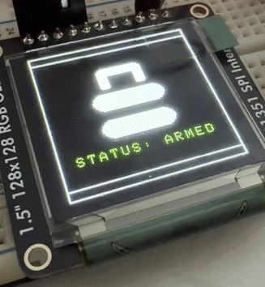

# Backpack-Guardian

Project Website: https://eec172-bagpackguardian.netlify.app/

Backpack Guardian is a smart embedded security system developed by Oluwateniola Sanusi and Maheshwari Tanwar that actively monitors backpacks for movement and tampering. When suspicious activity occurs, the system immediately triggers an alert, sounds an alarm, and sends a notification through the cloud.
